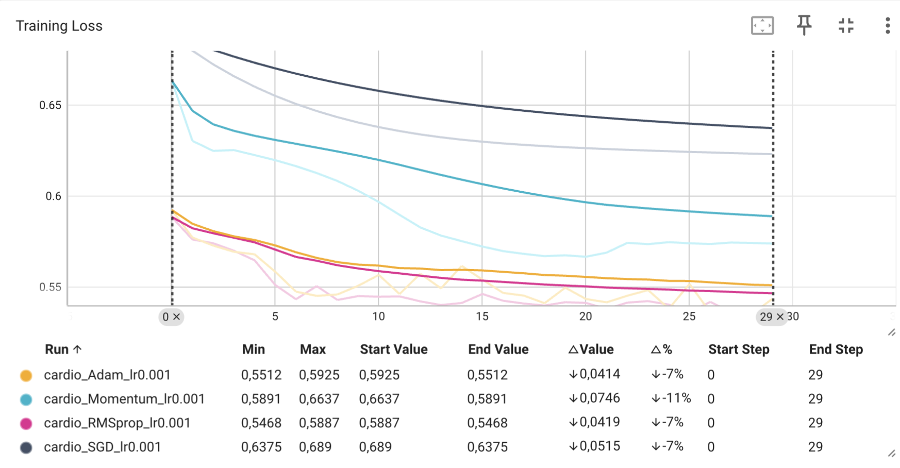

## Exo 1

### q1a 

- C'est une mauvaise pratique car le StandardScaler utilise aussi les données du jeu de validation et du test pour calculer la moyenne et l'écart type.
Du coup le modèle a indirectement accès à des informations qu'il ne devrait pas avoir (=on a du data leakage). Il faudrait faire le fit du StandardScaler uniquement sur le train puis faire transform sur le train, val et test.

- On peut utiliser IterableDataset car ça permet de charger les données progressivement au lieu de charger tout le dataset directement en mémoire.
## Exo 2

### q2a
1) 
```
$ python trainTestDebugIA.py 
Époque 1/10 - Loss moyenne: 0.8456
Époque 2/10 - Loss moyenne: 0.8118
Époque 3/10 - Loss moyenne: 0.7995
Époque 4/10 - Loss moyenne: 0.7914
Époque 5/10 - Loss moyenne: 0.7839
Époque 6/10 - Loss moyenne: 0.7753
Époque 7/10 - Loss moyenne: 0.7669
Époque 8/10 - Loss moyenne: 0.7586
Époque 9/10 - Loss moyenne: 0.7503
Époque 10/10 - Loss moyenne: 0.7420
``` 

Avec l1_lambda= 0.1 et l2_lambda= 0, on remarque que la régularisation est très forte et qu'on a du underfitting.
On voit que la loss baisse mais qu'une régularisation trop forte empêche le modèle d'apprendre correctement car les poids sont trop poussés vers 0.

2) Pour appliquer la régularisation L2 directement dans l'optimiseur, on peut utiliser l'argument `weight_decay`.

3) La L1 pousse certains poids jusqu'à 0 alors que la L2 réduit les poids sans forcément les mettre à 0.

## Exo 3

--> voir fichier `train_exo3.py`

### question 3a

1) 

2) On voit que RMSprop et Adam convergent plus rapidement au début. A la fin, RMSprop obtient la loss la plus faible avec environ 0.5468, puis Adam avec environ 0.5512.

3) On voit que Momentum converge plus rapidement que SGD simple. En effet Momentum a une loss d'environ 0.5891 alors que SGD est autour de 0.6375.
L'effet de l'ajout du moment sur la descente de gradient permet de garder une partie de la direction des gradients précédents. Du coup la descente est plus rapide et plus stable et elle éviteles oscillations.


## Exo 4

Résultat après lancement du script - fichier `train_exo4.py`:
```
Epoch 1/30 - Loss moyenne: 0.5873
Epoch 2/30 - Loss moyenne: 0.5790
Epoch 3/30 - Loss moyenne: 0.5737
Epoch 4/30 - Loss moyenne: 0.5705
Epoch 5/30 - Loss moyenne: 0.5589
Epoch 6/30 - Loss moyenne: 0.5490
Epoch 7/30 - Loss moyenne: 0.5467
Epoch 8/30 - Loss moyenne: 0.5465
Epoch 9/30 - Loss moyenne: 0.5449
Epoch 10/30 - Loss moyenne: 0.5429
Epoch 11/30 - Loss moyenne: 0.5430
Epoch 12/30 - Loss moyenne: 0.5428
Epoch 13/30 - Loss moyenne: 0.5431
Epoch 14/30 - Loss moyenne: 0.5412
Epoch 15/30 - Loss moyenne: 0.5439
Epoch 16/30 - Loss moyenne: 0.5403
Epoch 17/30 - Loss moyenne: 0.5397
Epoch 18/30 - Loss moyenne: 0.5395
Epoch 19/30 - Loss moyenne: 0.5407
Epoch 20/30 - Loss moyenne: 0.5383
Epoch 21/30 - Loss moyenne: 0.5385
Epoch 22/30 - Loss moyenne: 0.5382
Epoch 23/30 - Loss moyenne: 0.5404
Epoch 24/30 - Loss moyenne: 0.5385
Epoch 25/30 - Loss moyenne: 0.5420
Epoch 26/30 - Loss moyenne: 0.5384
Epoch 27/30 - Loss moyenne: 0.5357
Epoch 28/30 - Loss moyenne: 0.5354
Epoch 29/30 - Loss moyenne: 0.5373
Epoch 30/30 - Loss moyenne: 0.5348
Precision: 0.7568 | Recall: 0.6988 | F1: 0.7266 | AUC: 0.8010
``` 

1) La précision correspond à la proportion de prédictions positives qui sont réellement positives (`Precision = TP / (TP + FP)`). Le rappel correspond à la proportion de personnes réellement positives que le modèle arrive à détecter (`Recall = TP / (TP + FN)`).

2) Dans le contexte médical, il vaut mieux privilégier un rappel élevé car on veut éviter de rater une personne réellement malade...

3) L'aire sous la courbe ROC permet de mesurer à quel point le modèle différencie bien les deux classes et plus elle est proche de 1, mieux c'est. Ici ça à l'air d'être bien car on obtient 0.8010, donc le modèle arrive plutôt bien à séparer les deux classes.