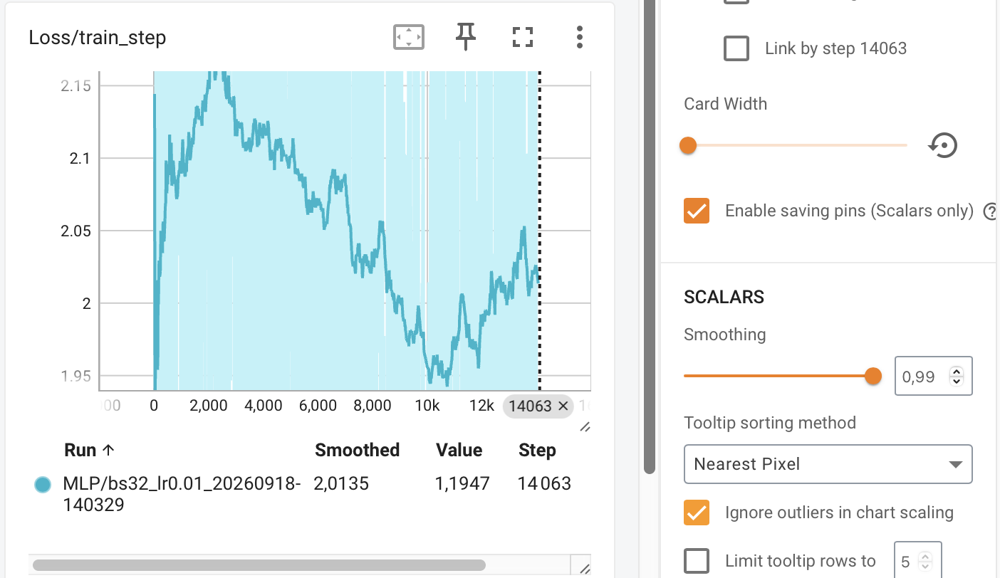
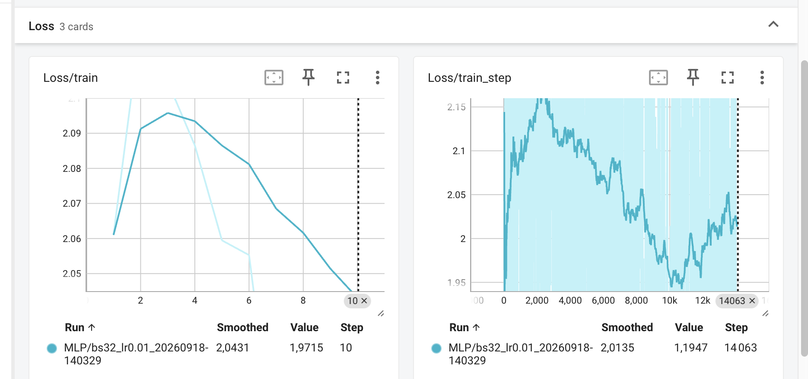
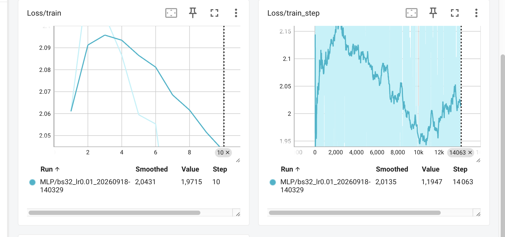

### question 1.C

GPU  Name  : Persistence-M 

### question  1.D

scancel 1506

### question 1.E

fichier :hello-slurm-1530.out   --> On voit le message :"Bonjour depuis SLURM" et on voit des infos sur les GPU .
et y a aussi : hello-slurm-1530.err  


### question 1.F

commandline : sacct -j 1506 --format=JobID,State,Elapsed,MaxRSS,ReqMem,ReqCPUS

ReqMem correspond à la mémoire qu'on a demandé à SLURM lorsqu'on a soumis le job.
MaxRSS correspond à la mémoire RAM réellement utilisée au maximum pendant l'exécution. 

## Exo2

to do pour activer mamba : `source ~/miniforge3/etc/profile.d/conda.sh`

### question 2.B 
Pour vérifier la version du Python : `python --version`
Python 3.10.21

Pour le binaire : `which python`
/mnt/hdd/homes/daberkane/miniforge3/envs/deeplearning/bin/python

### question 2d

PyTorch version: 2.14.0+cu130
CUDA available: True
Device count: 1
Device 0 name: NVIDIA L4

## Exo3 

### question 3a

mettre image


### question 3b
X  : (N, 3)
W1 : (m, 3)
b1 : (1, m) -> diffusé en (N, m)
H  : (N, m)
W2 : (t, m)
b2 : (1, t) -> diffusé en (N, t)
Y  : (N, t)

### question 3c

TODO : mettre image

### question 3d

TODO : mettre image 


### question 3e

- Pourquoi utilisons-nous la règle de la chaîne (chain rule) pour calculer les gradients dans les réseaux de neurones profonds ?

TODO reprendre ce qui est écrit dans le cahier 

- Quelles sont les principales raisons d'utiliser des mini-batchs plutôt que d'optimiser sur un seul exemple à la fois ou sur l’ensemble total des données ?

TODO  reprendre ce qui est écrit dans le cahier


### question 3f

TODO : mettre image 


## Exo 4

### question 4a

Le batch size correspond au nombre de batch qu'on veut.
Le shuffle c'est un paramètre qui permet de dire si on mélange ou pas les données. 

Le paramètre shuffle prend une valeur différente entre l'entraînement et le test : il est activé (shuffle=True) à l'entraînement pour diversifier les mini-batches et éviter que le modèle ne mémorise l'ordre des données, tandis qu'il est désactivé (shuffle=False) au test afin de garantir une évaluation fixe, claire et reproductible

### question 4b

1) Dans la méthode forward, pourquoi utilise-t-on torch.flatten(x, 1) avant de passer les données à la couche linéaire ?

On utilise cela car le torch.flatten permet de transformer le tenseur 4D qu'on a en un tenseur 2D de forme (batch_size, 3072). Ici, le paramètre 1 conserve la première dimension (batch_size, le nombre d'images dans le paquet) et aplatit tout le reste.

2) Pourquoi est-il crucial de ne pas ajouter de fonction d'activation Softmax à la fin de notre réseau quand on s'apprête à utiliser nn.CrossEntropyLoss dans PyTorch ?

Il est crucial de ne pas ajouter de Softmax à al fin de notre réseau car la classe nn.CrossEntropyLoss de PyTorch intègre déjà cette opération (via LogSoftmax) de manière optimisée. Du coup si on ajoutait ça appliquerait la fonction deux fois et ça fausserait les gradients et la perte.

### question 4c

- Résultat du script :

Epoch 01 | loss=2.0940 | acc=0.3293
Epoch 02 | loss=2.1155 | acc=0.3567
Epoch 03 | loss=2.1447 | acc=0.3606
Epoch 04 | loss=2.0691 | acc=0.3842
Epoch 05 | loss=2.0697 | acc=0.3882
Epoch 06 | loss=2.0513 | acc=0.3950
Epoch 07 | loss=2.0096 | acc=0.4057
Epoch 08 | loss=1.9838 | acc=0.4151
Epoch 09 | loss=1.9656 | acc=0.4211
Epoch 10 | loss=1.9489 | acc=0.4266

- Quelle est la différence fondamentale entre `optimizer.zero_grad()` et `loss.backward()` ?

La difféerence est que : `optimizer.zero_grad()` efface les gradients accumulés lors des étapes précédentes tandis que `loss.backward()` calcule les nouveaux gradients de la perte par rapport aux paramètres du modèle via la rétropropagation

### question 4d

1) On utilise with torch.no_grad(): lors de l'évaluation pour désactiver la différenciation automatique, car les poids du réseau ne sont pas mis à jour.
Cela libère une importante quantité de mémoire vidéo (VRAM) et accélère le calcul en évitant la construction inutile du graphe d'opérations.

2) On doit s'attendre à une accuracy de 10% car le jeune de données à 10 classes 


## Exo 5

### question 5a 

On doit inclure ça pour éviter d'écraser par erreur les données des entraînements précédents tout en pouvant  comparer et tracer facilement l'impact de chaque configuration dans TensorBoard.


### output résultat entre q5b à 5c

Output du script train_tb.py : 
```
Epoch 01 | train_loss=2.0610 | val_loss=2.0995 | val_acc=0.315
Epoch 02 | train_loss=2.1212 | val_loss=2.2356 | val_acc=0.326
Epoch 03 | train_loss=2.1047 | val_loss=2.1255 | val_acc=0.353
Epoch 04 | train_loss=2.0866 | val_loss=2.4315 | val_acc=0.327
Epoch 05 | train_loss=2.0595 | val_loss=2.1227 | val_acc=0.355
Epoch 06 | train_loss=2.0553 | val_loss=2.0049 | val_acc=0.376
Epoch 07 | train_loss=1.9951 | val_loss=2.2681 | val_acc=0.356
Epoch 08 | train_loss=2.0153 | val_loss=2.2121 | val_acc=0.378
Epoch 09 | train_loss=1.9733 | val_loss=2.3913 | val_acc=0.359
Epoch 10 | train_loss=1.9715 | val_loss=2.2206 | val_acc=0.386
```
### question 5d

`scp -r daberkane@157.159.104.128:"/Users/doha/Desktop/3A/Intro au deep learning/CSC8607/TP1" ./runs`

C'est à la valeur de 0.99 que l'on voit mieux 


- Pourquoi observe-t-on autant de bruit sur Loss/train_step comparativement à Loss/train

On observe autant de bruit car le nombre d'échantillon ne varie pas de la même manière.

### question 5e 

TODO: Analyse des graphes et des résultas des epochs


Run 1 : LR = 1e-2, batch_size = 32

```
Epoch 01 | train_loss=2.0610 | val_loss=2.0995 | val_acc=0.315
Epoch 02 | train_loss=2.1212 | val_loss=2.2356 | val_acc=0.326
Epoch 03 | train_loss=2.1047 | val_loss=2.1255 | val_acc=0.353
Epoch 04 | train_loss=2.0866 | val_loss=2.4315 | val_acc=0.327
Epoch 05 | train_loss=2.0595 | val_loss=2.1227 | val_acc=0.355
Epoch 06 | train_loss=2.0553 | val_loss=2.0049 | val_acc=0.376
Epoch 07 | train_loss=1.9951 | val_loss=2.2681 | val_acc=0.356
Epoch 08 | train_loss=2.0153 | val_loss=2.2121 | val_acc=0.378
Epoch 09 | train_loss=1.9733 | val_loss=2.3913 | val_acc=0.359
Epoch 10 | train_loss=1.9715 | val_loss=2.2206 | val_acc=0.386
```

Run 2 : LR = 1e-3, batch_size = 32

```
Epoch 01 | train_loss=1.6796 | val_loss=1.5914 | val_acc=0.445
Epoch 02 | train_loss=1.4876 | val_loss=1.5359 | val_acc=0.457
Epoch 03 | train_loss=1.4024 | val_loss=1.5374 | val_acc=0.467
Epoch 04 | train_loss=1.3410 | val_loss=1.4753 | val_acc=0.493
Epoch 05 | train_loss=1.2925 | val_loss=1.4765 | val_acc=0.491
Epoch 06 | train_loss=1.2448 | val_loss=1.4482 | val_acc=0.504
Epoch 07 | train_loss=1.2086 | val_loss=1.4610 | val_acc=0.499
Epoch 08 | train_loss=1.1731 | val_loss=1.4616 | val_acc=0.503
Epoch 09 | train_loss=1.1383 | val_loss=1.4704 | val_acc=0.509
Epoch 10 | train_loss=1.1104 | val_loss=1.4675 | val_acc=0.511
```


Run 3 : LR = 1e-1, batch_size = 128

````
Epoch 01 | train_loss=nan | val_loss=nan | val_acc=0.096
Epoch 02 | train_loss=nan | val_loss=nan | val_acc=0.096
Epoch 03 | train_loss=nan | val_loss=nan | val_acc=0.096
Epoch 04 | train_loss=nan | val_loss=nan | val_acc=0.096
Epoch 05 | train_loss=nan | val_loss=nan | val_acc=0.096
Epoch 06 | train_loss=nan | val_loss=nan | val_acc=0.096
Epoch 07 | train_loss=nan | val_loss=nan | val_acc=0.096
Epoch 08 | train_loss=nan | val_loss=nan | val_acc=0.096
Epoch 09 | train_loss=nan | val_loss=nan | val_acc=0.096
Epoch 10 | train_loss=nan | val_loss=nan | val_acc=0.096
```

